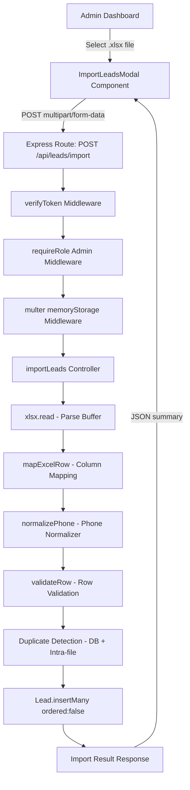

# Design Document: Bulk Excel Lead Import

## Overview

This design describes the technical implementation of bulk lead import from Excel files into the Hanuvansh CRM. The feature adds a new `POST /api/leads/import` endpoint that accepts `.xlsx` files via multipart upload, parses rows, normalizes phone numbers, detects duplicates, validates data, and bulk-inserts valid leads. A React modal component in the Admin dashboard provides file selection, preview, and result feedback.

The design integrates with the existing auth stack (`verifyToken` + `requireRole('Admin')`), the existing Lead model (extended with optional real-estate fields), and the existing error handler middleware. New dependencies: `multer` (memory storage for file upload) and `xlsx` (Excel parsing).

## Architecture



### Data Flow

1. Admin selects `.xlsx` file in the modal
2. Frontend reads file client-side for preview (first 5 rows via `xlsx` in browser)
3. Admin confirms import → file sent as `multipart/form-data`
4. Backend multer captures file buffer in memory (no disk write)
5. Controller parses buffer with `xlsx`, iterates rows
6. Each row: normalize phone → validate → check duplicates
7. Valid, non-duplicate rows collected for bulk insert
8. `insertMany` with `ordered: false` for partial-failure resilience
9. Response returns counts + details for duplicates and invalid rows

## Components and Interfaces

### Backend Components

#### 1. Phone Normalizer Utility
**File:** `backend/src/utils/phoneNormalizer.js`

```javascript
/**
 * Normalizes a phone number by stripping all non-digit characters
 * and removing country code prefix if present.
 * 
 * @param {string|number} raw - Raw phone number input
 * @returns {string} Normalized 10-digit phone string, or stripped digits if not 10
 */
function normalizePhone(raw) {
  if (raw === null || raw === undefined) return '';
  const digits = String(raw).replace(/[^0-9]/g, '');
  // If 12 digits starting with "91", strip country code
  if (digits.length === 12 && digits.startsWith('91')) {
    return digits.slice(2);
  }
  // If 11 digits starting with "0" (trunk prefix), strip it
  if (digits.length === 11 && digits.startsWith('0')) {
    return digits.slice(1);
  }
  return digits;
}

module.exports = { normalizePhone };
```

#### 2. Excel Row Mapper Utility
**File:** `backend/src/utils/excelMapper.js`

```javascript
/**
 * Maps an Excel row object (keyed by column header) to a Lead-compatible object.
 * 
 * @param {Object} row - Raw row from xlsx sheet_to_json
 * @param {string} adminUserId - The importing admin's user ID
 * @returns {Object} Mapped lead data
 */
function mapExcelRow(row, adminUserId) {
  return {
    name: (row['Lead Name'] || '').toString().trim(),
    number: normalizePhone(row['Lead Phone Number']),
    date: parseDate(row['Lead Date']),
    remark: (row['Notes'] || '').toString().trim(),
    serviceType: (row['Service Type'] || '').toString().trim(),
    propertyType: (row['Property Type'] || '').toString().trim(),
    locality: (row['Locality'] || '').toString().trim(),
    configuration: (row['Configuration'] || '').toString().trim(),
    price: (row['Price'] || '').toString().trim(),
    buildingName: (row['Building/Project Name'] || '').toString().trim(),
    address: (row['Address'] || '').toString().trim(),
    // Defaults per Requirement 7
    user: adminUserId,
    createdBy: adminUserId,
    assignedTo: null,
    assignedBy: null,
    status: 'CNR',
    leadSource: 'Other',
    leadFrom: ''
  };
}

/**
 * Parses a date string in DD/MM/YYYY format. Returns current date on failure.
 */
function parseDate(raw) {
  if (!raw) return new Date();
  const str = String(raw).trim();
  // Try DD/MM/YYYY
  const parts = str.match(/^(\d{1,2})[\/\-](\d{1,2})[\/\-](\d{4})$/);
  if (parts) {
    const [, day, month, year] = parts;
    const date = new Date(Number(year), Number(month) - 1, Number(day));
    if (!isNaN(date.getTime())) return date;
  }
  // Try native Date parse as fallback
  const fallback = new Date(str);
  if (!isNaN(fallback.getTime())) return fallback;
  // Default to current date
  return new Date();
}

module.exports = { mapExcelRow, parseDate };
```

#### 3. Row Validator Utility
**File:** `backend/src/utils/rowValidator.js`

```javascript
/**
 * Validates a mapped lead row.
 * 
 * @param {Object} mappedRow - Output of mapExcelRow
 * @returns {{ valid: boolean, reason?: string }}
 */
function validateRow(mappedRow) {
  if (!mappedRow.name || mappedRow.name.trim() === '') {
    return { valid: false, reason: 'Name is required' };
  }
  if (!/^\d{10}$/.test(mappedRow.number)) {
    return { valid: false, reason: 'Invalid phone number' };
  }
  return { valid: true };
}

module.exports = { validateRow };
```

#### 4. Import Controller
**File:** `backend/src/controllers/importController.js`

```javascript
const XLSX = require('xlsx');
const Lead = require('../models/Lead');
const { normalizePhone } = require('../utils/phoneNormalizer');
const { mapExcelRow } = require('../utils/excelMapper');
const { validateRow } = require('../utils/rowValidator');

/**
 * POST /api/leads/import
 * Handles bulk Excel lead import.
 */
const importLeads = async (req, res, next) => {
  try {
    if (!req.file) {
      return res.status(400).json({
        success: false,
        message: 'No file provided',
        statusCode: 400
      });
    }

    // Parse Excel from buffer
    const workbook = XLSX.read(req.file.buffer, { type: 'buffer' });
    const sheetName = workbook.SheetNames[0];
    const rows = XLSX.utils.sheet_to_json(workbook.Sheets[sheetName]);

    const adminUserId = req.user.userId;
    const duplicateDetails = [];
    const invalidDetails = [];
    const validLeads = [];

    // Get all existing phone numbers for duplicate detection
    const existingLeads = await Lead.find({}, { number: 1 });
    const existingNumbers = new Set(existingLeads.map(l => l.number));
    const seenInFile = new Set();

    for (let i = 0; i < rows.length; i++) {
      const rowNum = i + 2; // +2 for header row + 1-based index
      const mapped = mapExcelRow(rows[i], adminUserId);

      // Validate row
      const validation = validateRow(mapped);
      if (!validation.valid) {
        invalidDetails.push({ row: rowNum, name: mapped.name, reason: validation.reason });
        continue;
      }

      // Duplicate detection: database
      if (existingNumbers.has(mapped.number)) {
        duplicateDetails.push({ row: rowNum, name: mapped.name, number: mapped.number });
        continue;
      }

      // Duplicate detection: within same file
      if (seenInFile.has(mapped.number)) {
        duplicateDetails.push({ row: rowNum, name: mapped.name, number: mapped.number });
        continue;
      }

      seenInFile.add(mapped.number);
      validLeads.push(mapped);
    }

    // Bulk insert with ordered: false for partial failure resilience
    let imported = 0;
    if (validLeads.length > 0) {
      try {
        const result = await Lead.insertMany(validLeads, { ordered: false });
        imported = result.length;
      } catch (err) {
        // BulkWriteError: some succeeded, some failed
        if (err.insertedDocs) {
          imported = err.insertedDocs.length;
        } else if (err.result && err.result.nInserted) {
          imported = err.result.nInserted;
        }
      }
    }

    res.status(200).json({
      success: true,
      message: 'Import completed',
      totalRows: rows.length,
      imported,
      duplicates: duplicateDetails.length,
      invalid: invalidDetails.length,
      duplicateDetails,
      invalidDetails
    });
  } catch (error) {
    next(error);
  }
};

module.exports = { importLeads };
```

#### 5. Multer Configuration
**File:** `backend/src/config/uploadConfig.js`

```javascript
const multer = require('multer');

const storage = multer.memoryStorage();

const fileFilter = (req, file, cb) => {
  const allowedMime = 'application/vnd.openxmlformats-officedocument.spreadsheetml.sheet';
  if (file.mimetype !== allowedMime) {
    const error = new Error('Invalid file type. Only .xlsx files are accepted');
    error.statusCode = 400;
    return cb(error, false);
  }
  if (!file.originalname.endsWith('.xlsx')) {
    const error = new Error('Invalid file type. Only .xlsx files are accepted');
    error.statusCode = 400;
    return cb(error, false);
  }
  cb(null, true);
};

const upload = multer({
  storage,
  fileFilter,
  limits: { fileSize: 5 * 1024 * 1024 } // 5 MB
});

module.exports = { upload };
```

#### 6. Route Addition
**File:** `backend/src/routes/leadRoutes.js` (modified)

```javascript
// New import added to existing route file:
const { upload } = require('../config/uploadConfig');
const { importLeads } = require('../controllers/importController');

// POST /api/leads/import - Bulk import leads from Excel (Admin only)
router.post('/import', requireRole('Admin'), upload.single('file'), importLeads);
```

This route is placed after `router.use(verifyToken)` so JWT auth is already enforced.

### Frontend Components

#### 7. ImportLeadsModal Component
**File:** `frontend/src/components/dashboard/ImportLeadsModal.jsx`

**Props:**
- `isOpen: boolean` — controls visibility
- `onClose: () => void` — close handler
- `onImportComplete: () => void` — callback to refresh lead list after import

**State:**
- `file: File | null` — selected file
- `preview: { headers: string[], rows: any[], totalRows: number } | null`
- `importing: boolean` — loading state
- `result: ImportResult | null` — response from API
- `error: string | null`

**Behavior:**
1. File input accepts only `.xlsx`
2. On file selection, parses locally with `xlsx` (loaded from CDN or bundled) to show preview
3. Displays file name, total data rows, first 5 rows in a table
4. "Import" button sends file via `api.post('/api/leads/import', formData, { headers: { 'Content-Type': 'multipart/form-data' } })`
5. Shows loading spinner during request
6. On success, shows result summary (imported/duplicates/invalid counts)
7. On error, displays error message
8. "Close" dismisses modal and triggers `onImportComplete` if any leads were imported

### Interface Contracts

**Import Endpoint Request:**
```
POST /api/leads/import
Authorization: Bearer <jwt_token>
Content-Type: multipart/form-data
Body: file (field name: "file")
```

**Import Endpoint Response (200):**
```json
{
  "success": true,
  "message": "Import completed",
  "totalRows": 50,
  "imported": 42,
  "duplicates": 5,
  "invalid": 3,
  "duplicateDetails": [
    { "row": 4, "name": "John Doe", "number": "9876543210" }
  ],
  "invalidDetails": [
    { "row": 7, "reason": "Name is required" }
  ]
}
```

## Data Models

### Lead Schema Extension

The existing Lead schema is extended with optional real-estate fields. All new fields default to empty string, ensuring backward compatibility.

```javascript
// New fields added to leadSchema (backend/src/models/Lead.js)
{
  serviceType: {
    type: String,
    trim: true,
    default: ''
  },
  propertyType: {
    type: String,
    trim: true,
    default: ''
  },
  locality: {
    type: String,
    trim: true,
    default: ''
  },
  configuration: {
    type: String,
    trim: true,
    default: ''
  },
  price: {
    type: String,
    trim: true,
    default: ''
  },
  buildingName: {
    type: String,
    trim: true,
    default: ''
  },
  address: {
    type: String,
    trim: true,
    default: ''
  }
}
```

### Import Result Model (response only, not persisted)

```typescript
interface ImportResult {
  success: boolean;
  message: string;
  totalRows: number;
  imported: number;
  duplicates: number;
  invalid: number;
  duplicateDetails: Array<{ row: number; name: string; number: string }>;
  invalidDetails: Array<{ row: number; name?: string; reason: string }>;
}
```

## Correctness Properties

*A property is a characteristic or behavior that should hold true across all valid executions of a system — essentially, a formal statement about what the system should do. Properties serve as the bridge between human-readable specifications and machine-verifiable correctness guarantees.*

### Property 1: Phone normalization produces valid output

*For any* string input to the phone normalizer, the output SHALL contain only digit characters (0-9) and no other characters.

**Validates: Requirements 4.1, 4.2, 4.4**

### Property 2: Phone normalization is idempotent

*For any* valid phone number input, normalizing the result a second time SHALL produce the same output as the first normalization: `normalizePhone(normalizePhone(x)) === normalizePhone(x)`.

**Validates: Requirements 4.5**

### Property 3: Duplicate detection preserves existing leads

*For any* set of existing leads in the database and any imported Excel file, after the import operation completes, all previously existing leads SHALL remain in the database with identical field values.

**Validates: Requirements 5.5, 5.6**

### Property 4: Intra-file duplicate detection keeps first occurrence only

*For any* Excel file containing rows with duplicate normalized phone numbers, the import SHALL accept only the first occurrence of each phone number and skip all subsequent rows with the same normalized number.

**Validates: Requirements 5.2, 5.4**

### Property 5: Row validation rejects invalid names and numbers

*For any* Excel row where the name is empty/whitespace-only OR the phone number does not normalize to exactly 10 digits, the row SHALL be rejected and not inserted into the database.

**Validates: Requirements 6.1, 6.2, 6.3, 6.4**

### Property 6: Import defaults invariant

*For any* successfully imported lead, the document SHALL have `status === 'CNR'`, `leadSource === 'Other'`, `assignedTo === null`, `assignedBy === null`, `user === adminId`, and `createdBy === adminId`.

**Validates: Requirements 7.1, 7.2, 7.3, 7.4, 7.5, 7.6**

### Property 7: Response count consistency

*For any* import operation, `totalRows === imported + duplicates + invalid`, and the length of `duplicateDetails` SHALL equal `duplicates`, and the length of `invalidDetails` SHALL equal `invalid`.

**Validates: Requirements 9.1, 9.2, 9.3**

### Property 8: Column mapping correctness

*For any* valid Excel row with all columns populated, the mapped lead object SHALL contain the correct value from each source column in its corresponding destination field (Lead Name → name, Lead Phone Number → number after normalization, Notes → remark, Service Type → serviceType, Property Type → propertyType, Locality → locality, Configuration → configuration, Price → price, Building/Project Name → buildingName, Address → address).

**Validates: Requirements 3.3, 3.4, 3.5, 3.6, 3.7, 3.8, 3.9, 3.10, 3.11, 3.12, 3.13**

## Error Handling

### Backend Error Handling

All errors follow the existing `errorHandler` middleware pattern:

| Scenario | Status | Message |
|----------|--------|---------|
| No file in request | 400 | "No file provided" |
| Invalid file extension | 400 | "Invalid file type. Only .xlsx files are accepted" |
| Invalid MIME type | 400 | "Invalid file type. Only .xlsx files are accepted" |
| File exceeds 5 MB | 400 | "File size exceeds 5 MB limit" |
| No auth token | 401 | "Access denied. No token provided." |
| Non-Admin role | 403 | "Access denied. Required role: Admin" |
| Corrupted/unreadable Excel | 400 | "Failed to parse Excel file" |
| Unexpected server error | 500 | Handled by global errorHandler |

**Multer error handling:** Multer's `MulterError` for file size is caught and transformed to the expected 400 response format in route-level error handling:

```javascript
// In route or controller, handle multer errors:
if (err instanceof multer.MulterError) {
  if (err.code === 'LIMIT_FILE_SIZE') {
    return res.status(400).json({
      success: false,
      message: 'File size exceeds 5 MB limit',
      statusCode: 400
    });
  }
}
```

### Frontend Error Handling

- Network errors: Caught by axios interceptor, displayed in modal
- 401 errors: Interceptor redirects to login (existing behavior)
- 400/403 errors: Error message extracted and shown in modal alert
- Uses existing `extractErrorMessage` utility from `frontend/src/utils/errorHandler.js`

## Testing Strategy

### Property-Based Tests (fast-check)

The project already includes `fast-check` as a dev dependency. Property tests will validate the correctness properties defined above.

**Configuration:**
- Minimum 100 iterations per property test
- Each test tagged with: `Feature: bulk-excel-lead-import, Property {N}: {description}`
- Test file: `backend/src/utils/phoneNormalizer.test.js`, `backend/src/utils/excelMapper.test.js`, `backend/src/controllers/importController.test.js`

**Properties to implement with PBT:**
1. Phone normalization output contains only digits (Property 1)
2. Phone normalization is idempotent (Property 2)
3. Intra-file duplicate detection keeps first occurrence (Property 4)
4. Row validation correctly rejects invalid rows (Property 5)
5. Import defaults are always set correctly (Property 6)
6. Response counts are consistent (Property 7)
7. Column mapping is correct (Property 8)

### Unit Tests (Jest + example-based)

- Auth middleware enforcement (401/403 responses)
- File validation (no file, wrong extension, wrong MIME)
- Specific phone normalization examples: `"(+91)-7600331516"` → `"7600331516"`
- Date parsing: `"15/01/2024"` → valid Date, `"invalid"` → current date
- Zero imports edge case (all duplicates/invalid)
- Multer error handling for oversize files

### Integration Tests (Jest + supertest + mongodb-memory-server)

- Full endpoint test: upload valid Excel → verify leads created in DB
- Duplicate detection against existing DB records
- Existing leads unchanged after import
- Large file (1000 rows) performance verification
- Schema backward compatibility (existing leads queryable after extension)

### Frontend Tests

- ImportLeadsModal renders for Admin, hidden for Agent
- File selection triggers preview display
- Import button disabled during loading
- Result summary displayed on success
- Error message displayed on failure
